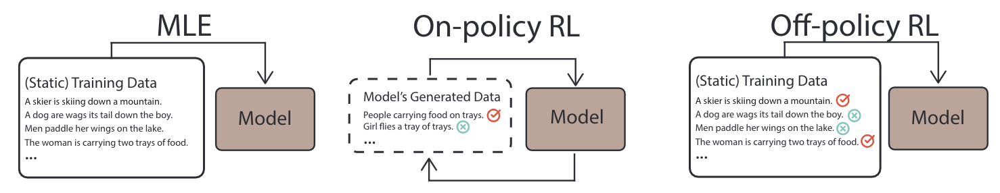

# Text Generation with Efficient (Soft) Q-Learning

[Link to the Paper](https://arxiv.org/)



# Requirements
Please see `requirements.txt` and `Dockerfile` for detailed dependencies. The major ones include
- `python 3.6 or later` (for type annotations and f-string)
- `pytorch==1.8.1`
- `transformers==4.5.1`

# Setup
### Docker Setup
To build the docker image, run the following script.

```bash
DOCKER_BUILDKIT=1 docker build \
    -t ${TAG} \
    -f Dockerfile .
```

### Additional steps (inside Docker)
1. Install the master branch of `texar` (and a few other dependencies) via `bash scripts/install_dependencies.sh`
2. Install [GEM-metrics](https://github.com/GEM-benchmark/GEM-metrics). We use the version at commit `2693f3439547a40897bc30c2ab70e27e992883c0`.

### Data Setup
1. Most of the data are available at `https://huggingface.co/datasets`.
2. We use `nltk==3.5` in data preprocessing.

# Experiments
###  Learning from Noisy (Negative) Text

```bash
python run_experiments.py \
    translation.task_name="entailment.snli_entailment_1_sampled" \
    translation.training_mode="sql-mixed" \
    translation.save_dir=${USER_SPECIFIED_SAVE_DIR} \
    translation.num_epochs=101 \
    translation.top_k=50 \
    translation.reward_shaping_min=-50 \
    translation.reward_shaping_max=50 \
    translation.reward_name="entailment3" \
    translation.warmup_training_mode="sql-offpolicy" \
    translation.warmup_num_epochs=5
```

**Details**
1. Maximum Decoding Length set to `10`
2. Decoder positiion embedding length set to `65`

### Black-box Universal Adversarial Attacks

```bash
python run_experiments.py \
    translation.task_name="attack.mnli" \
    translation.training_mode="sql-mixed" \
    translation.save_dir=${USER_SPECIFIED_SAVE_DIR} \
    translation.num_epochs=51 \
    translation.top_k=50 \
    translation.num_batches_per_epoch=1000 \
    translation.reward_shaping_min=-50 \
    translation.reward_shaping_max=50 \
    translation.reward_name="entailment2"
```

**Details**
1. Decoder position embedding length set to `75` (MNLI)
2. Change `rewards = (rewards + 10 * nll_reward + 100) / 2`

### Prompting Pre-trained Language Model for Controllable Generation
```bash
python run_experiments.py \
    translation.task_name="prompt.gpt2_mixed" \
    translation.training_mode="sql-mixed" \
    translation.save_dir=${USER_SPECIFIED_SAVE_DIR} \
    translation.num_epochs=501 \
    translation.num_batches_per_epoch=100 \
    translation.reward_shaping_min=-50 \
    translation.reward_shaping_max=50 \
    translation.top_k=50 \
    translation.reward_name="gpt2-topic" \
    translation.warmup_training_mode="sql-offpolicy" \
    translation.warmup_num_epochs=100
```

**Details**
1. For different token length, remember to change the `max_length`.

### Supervised Language Generation Tasks
```bash
python run_experiments.py \
    translation.task_name="standard.e2e" \
    translation.training_mode="sql-mixed" \
    translation.save_dir=${USER_SPECIFIED_SAVE_DIR} \
    translation.num_epochs=201 \
    translation.reward_shaping_min=-50 \
    translation.reward_shaping_max=50 \
    translation.reward_name="bleu"
```

# Code Structure

### `configs/`
This directory contains configurations for models as well as data. Notably, `configs/data` lists some task-specific configurations such as file-paths, and `configs/models` lists configurations of models, all in the `texar` format. `configs/config.yaml` lists configurations in the [hydra](https://github.com/facebookresearch/hydra) format. Please update the paths etc based on your own usages.

### `sql/`
This directory contains the core components of the soft Q-learning algorithm for text generation.

### `modules/`
This directory contains the core components of the models and GEM-metrics.